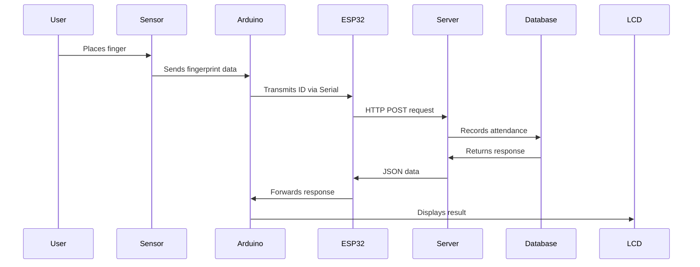

# Smart Fingerprint Attendance System  

  

A complete biometric attendance system with hardware integration and web interface, supporting both local network and mobile access.  

---

## Key Features  

### Core Functionality  
- **Fingerprint authentication** using R307 sensor  
- **Real-time attendance logging** via ESP32 WiFi  
- **Web-based admin dashboard** with data visualization  
- **Student dashboard** for individual attendance tracking  
- **Mobile responsive** interface (works on all devices)  

### Automation & Reporting  
- **Automated email reports** (daily/monthly)  
- **Timetable integration** for class scheduling  
- **Multi-user support** with enrollment system  
- **CSV export** of attendance records  

---

## System Requirements  

### Hardware Components  
| Component       | Quantity | Notes                     |  
|-----------------|----------|---------------------------|  
| Arduino Uno     | 1        | Main controller           |  
| ESP32           | 1        | WiFi communication        |  
| R307 Fingerprint| 1        | Biometric sensor          |  
| 16x2 I2C LCD    | 1        | User interface            |  
| Buzzer          | 1        | Audio feedback            |  
| Breadboard      | 1        | Optional for prototyping  |  
| Jumper wires    | 15+      | Various colors recommended|  

### Software Requirements  
- [XAMPP](https://www.apachefriends.org/) (PHP 7.4+ and MySQL)  
- Arduino IDE 2.0+  
- Modern web browser (Chrome/Firefox/Edge)  
- curl (included in project files)  

---

## Installation Guide  

### 1. Server Setup  
1. **Install XAMPP** and start Apache/MySQL services  
2. **Clone repository** to htdocs:  
   ```bash  
   git clone https://github.com/Spacey6849/smart-fingerprint-attendance-system.git  
   ```  
3. **Database setup**:  
   ```sql  
   CREATE DATABASE attendance_db;  
   USE attendance_db;  
   SOURCE attendance_system/database/attendance_db.sql;  
   ```  
4. **Configure connection** in `includes/config.php`:  
   ```php  
   $db_host = 'localhost';  
   $db_user = 'root';  
   $db_pass = '';  
   $db_name = 'attendance_db';  
   ```  

### 2. Hardware Configuration  

#### Wiring Diagram  
```plaintext  
┌─────────────┐         ┌─────────────┐  
│   ESP32     │         │  Arduino Uno│  
├─────────────┤         ├─────────────┤  
│             │         │             │  
│ GPIO16 (RX) ├─────────► TX (Pin 1)  │  
│ GPIO17 (TX) ◄─────────┤ RX (Pin 0)  │  
│ GND         ├─────────┤ GND         │  
│ 3.3V        │         │             │  
└─────────────┘         │             │  
                        │ SDA (A4)    ├─────► LCD SDA  
                        │ SCL (A5)    ├─────► LCD SCL  
                        │ Pin 7       ├─────► Buzzer (+)  
                        │ GND         ├─────► Buzzer (-)  
                        │             │  
                        │ Pin 2 (RX)  ├─────► R307 TX  
                        │ Pin 3 (TX)  ├─────► R307 RX  
                        │ 5V          ├─────► R307 VCC  
                        │ GND         ├─────► R307 GND  
                        └─────────────┘  
```  

#### Connection Details  
| Connection | ESP32 Pin | Arduino Pin | Wire Color | Notes |  
|------------|-----------|-------------|------------|-------|  
| Serial COM | GPIO16    | TX (1)      | Green      | RX→TX |  
|            | GPIO17    | RX (0)      | Yellow     | TX→RX |  
| Power      | GND       | GND         | Black      |       |  

### 3. Mobile Access Setup  
1. **Find local IP**:  
   - Windows: `ipconfig`  
   - Mac/Linux: `ifconfig`  
2. **Connect devices** to same WiFi network  
3. **Access system**:  
   ```  
   http://[YOUR_LOCAL_IP]/attendance_system  
   ```  

---

## Dashboard Access  


### Student Dashboard  
```  
http://localhost/attendance_system/admin/studentdashboard.php  
```
Dashboard:

Statistics:

Attendance records:


**Features**:  
- Personalized attendance statistics  
- Visual analytics (pie/bar charts)  
- Filterable attendance records  
- Contact information display  

---

## Automation Setup  

### Windows Task Scheduler Configuration  

#### 1. Automated Absence Marking  
1. Open **Task Scheduler**  
2. Create new task with:  
   - Trigger: Daily at preferred time  
   - Action: Run `curl.exe` with arguments:  
     ```  
     -s http://localhost/attendance_system/api/api.php?action=mark_absent_students  
     ```  

#### 2. Automated Reports  
- **Daily Report**: Runs at specified time with:  
  ```  
  -s http://localhost/attendance_system/api/sendreport.php  
  ```  
- **Monthly Report**: Runs on 1st of each month  

---

## Enrollment Process  

### Student Registration  
1. Access `enroll.php` via web interface  
2. Fill student details and note generated Fingerprint ID  

### Fingerprint Enrollment  
1. Disconnect ESP32 from Arduino  
2. Open Arduino Serial Monitor  
3. Send enrollment command: `e`  
4. Enter Fingerprint ID when prompted  
5. Scan finger twice as instructed  

---

## System Workflow  



---

## Security Recommendations  
```diff  
+ Change default credentials immediately  
+ Enable HTTPS for production use  
+ Use .htaccess protection for admin pages  
- Never expose system without authentication  
+ Regular database backups recommended  
```  

---

## Troubleshooting Guide  

| Issue | Solution |  
|-------|----------|  
| No WiFi connection | Check ESP32 credentials |  
| Fingerprint errors | Clean sensor surface |  
| LCD display issues | Verify I2C address (0x27/0x3F) |  
| Database errors | Check config.php credentials |  
| Mobile connection fails | Disable firewall temporarily |  

---

## License  
MIT License  
Copyright (c) [2025] [Spacey649]  

---

**Support & Contact**  
📧 Help: [Instagram @spacey6849](https://instagram.com/spacey6849)  
🐛 Issues: [GitHub Issues](https://github.com/Spacey6849/smart-fingerprint-attendance-system/issues)
